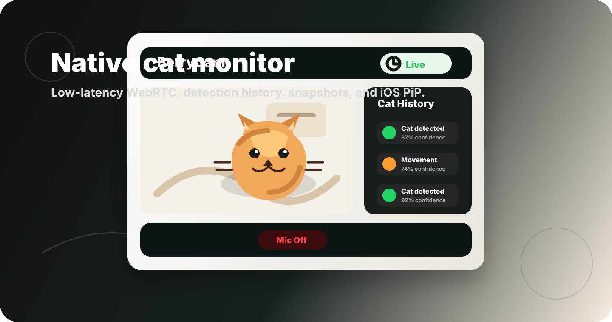
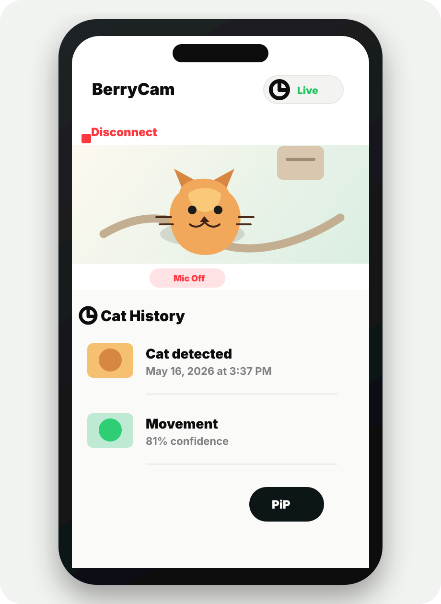
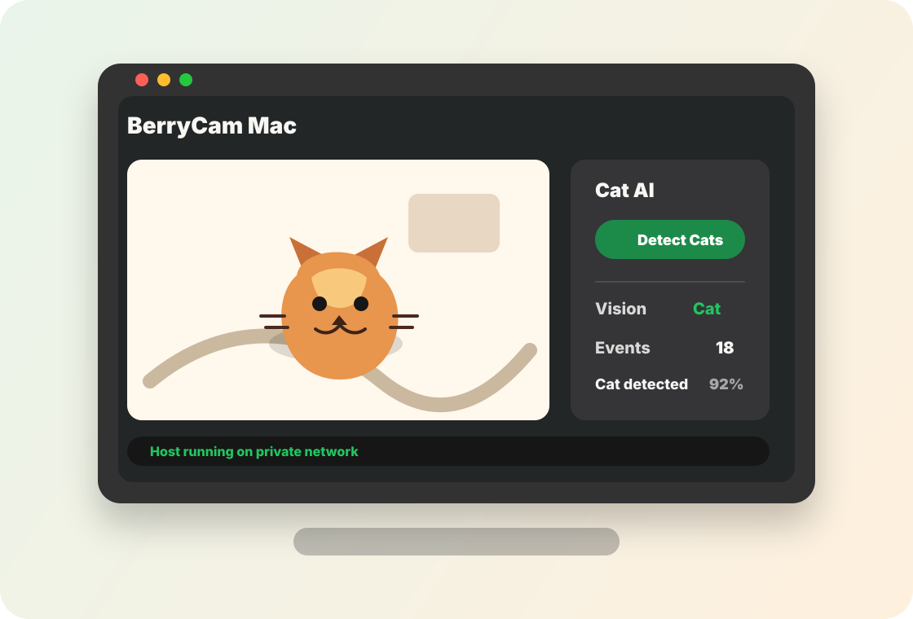

# BerryCam



BerryCam is a native Swift pet monitor for keeping an eye on a cat at home from an iPhone or Mac. The Mac app hosts the camera, runs lightweight cat detection, stores timestamped detection snapshots, and streams live video to iOS through WebRTC.

The project is intentionally private-network first: use Tailscale or a local network address, keep the Mac at home as the host, and connect from the iPhone viewer without exposing the camera to the public internet.

## App Screens

The images below are documentation mockups made with generated cat artwork, not real webcam captures.

| iOS viewer | macOS host |
| --- | --- |
|  |  |

## Features

- Native WebRTC live video from Mac to iPhone.
- iOS Picture in Picture support for keeping the stream visible after going Home.
- Lightweight cat detection on the Mac host.
- Detection history with timestamps, confidence, and snapshot thumbnails.
- Snapshot detail viewer with swipe navigation and save-to-Photos.
- Recent iPhone connection hosts for quick reconnects.
- Private access code for pairing a viewer to the host.
- Microphone defaults to off, with optional two-way audio.

## Architecture

- `BerryCamMac`: macOS SwiftUI host app
  - Captures the Mac camera with WebRTC's native camera capturer.
  - Runs the local HTTP signaling and history server.
  - Runs cat detection and stores bounded event snapshots.
  - Answers one viewer WebRTC offer at a time.
- `BerryCamWatch`: iOS SwiftUI viewer app
  - Connects to the Mac's Tailscale host, local IP, or `100.x.y.z` address.
  - Creates a receive-only WebRTC offer for video and audio.
  - Renders the remote video track natively.
  - Shows inline history below the live view and supports PiP.
- `Shared`: WebRTC aliases, signaling models, detection models, and cross-platform video view wrappers.

## Why WebRTC

BerryCam uses WebRTC as the main streaming path because it is a strong fit for low-latency live video. The Mac and iPhone exchange SDP and ICE candidates through a tiny local signaling API, then WebRTC carries the media stream directly.

Tailscale gives both devices stable private addresses, which keeps the setup simple while avoiding a public camera endpoint.

## Setup

1. Install Xcode.
2. Install XcodeGen if needed:

```bash
brew install xcodegen
```

3. Generate the project:

```bash
xcodegen generate
```

4. Open `BerryCam.xcodeproj`.
5. Let Xcode resolve the Swift Package dependency:

```text
https://github.com/livekit/webrtc-xcframework.git
```

## Travel Flow

1. Install Tailscale on the Mac and iPhone.
2. Sign in to the same Tailscale account on both devices.
3. Start `BerryCamMac` on the Mac.
4. Enter a private access code and start the host.
5. In `BerryCamWatch`, select a recent host or enter:

```text
Mac Tailscale name, local IP, or 100.x.y.z
```

6. Use the same access code and connect.
7. After live video starts, go Home on iPhone to continue watching with native PiP.

## Mac Checklist

- Plug the Mac into power.
- Disable sleep while plugged in.
- Keep the lid open so the camera remains available.
- Test from iPhone cellular data before leaving.
- Use a private access code.
- Periodically review detection history storage if the host runs for many days.

## Current Status

BerryCam is an MVP native WebRTC implementation with real-time cat detection, timestamped history, snapshots, iOS PiP, and native SwiftUI apps for macOS and iOS.
